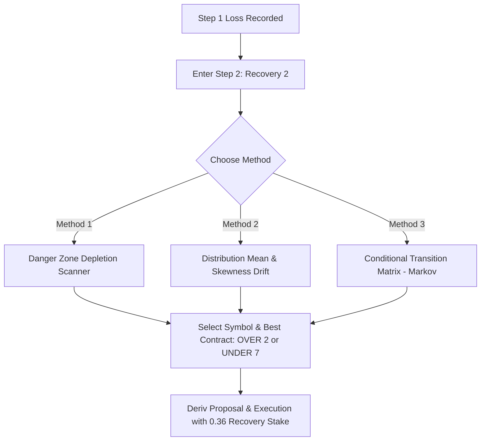

# Strategy S: Step 2 (Recovery 2) Statistical Selection Methods

This document presents three statistical methods to replace random selection for **Step 2 (Recovery 2)** in **Strategy S**.

---

## 1. Step 2 Context & Deriv Contract Mechanics

In Strategy S, Step 2 is executed when **Step 1 (Recovery 1)** results in a loss.

### Contract Specifications

Step 2 trades either **`OVER 2`** or **`UNDER 7`** on a 1-tick duration:

| Contract | Deriv Type | Barrier | Winning Digits | Theoretical Win Rate | Losing "Danger Zone" | Deriv Payout | Calibrated Divisor |
| :--- | :--- | :---: | :---: | :---: | :---: | :---: | :---: |
| **`OVER 2`** | `DIGITOVER` | **`2`** | `3, 4, 5, 6, 7, 8, 9` (7 digits) | **70.0%** | **`0, 1, 2`** (3 digits) | ~36–40% net | **`0.36`** |
| **`UNDER 7`** | `DIGITUNDER` | **`7`** | `0, 1, 2, 3, 4, 5, 6` (7 digits) | **70.0%** | **`7, 8, 9`** (3 digits) | ~36–40% net | **`0.36`** |

> [!NOTE]
> **The Overlapping Safe Zone**: Notice that digits **`3, 4, 5, 6`** are winning digits for **both** `OVER 2` and `UNDER 7`.  
> The only decision is choosing whether the market is currently less likely to hit **Low Digits `[0, 1, 2]`** (favoring `OVER 2`) or **High Digits `[7, 8, 9]`** (favoring `UNDER 7`), and which of the 10 volatility symbols provides the strongest statistical edge.

---

## 2. The 3 Proposed Statistical Methods

---

### Method 1: Danger Zone Depletion Scanner (Risk-Minimization Filter)

#### Concept
Rather than attempting to predict the winning digit, this method **actively avoids the loss conditions**. It scans recent tick windows across all 10 synthetic volatility markets to find the market where the relevant "danger digits" are at their lowest empirical frequency.

#### Danger Zones Defined
* **Zone L (Low Danger for `OVER 2`)**: Digits $\{0, 1, 2\}$
* **Zone H (High Danger for `UNDER 7`)**: Digits $\{7, 8, 9\}$

Under a uniform distribution, the expected baseline probability for any 3-digit zone is:
$$P(\text{Zone}) = \frac{3}{10} = 30.0\%$$

#### Algorithm Steps
1. **Window Sampling**: For each of the 10 volatility symbols (`1HZ10V` through `R_100`), inspect the last **$N = 40$ ticks**.
2. **Frequency Computation**:
   $$f_L(\text{sym}) = \frac{\text{Count}(\text{digits} \in \{0, 1, 2\})}{40} \times 100\%$$
   $$f_H(\text{sym}) = \frac{\text{Count}(\text{digits} \in \{7, 8, 9\})}{40} \times 100\%$$
3. **Suppression Scoring**:
   * An edge exists when either $f_L$ or $f_H$ drops significantly below the $30\%$ baseline (e.g. $10\% - 17.5\%$).
   * Calculate the **Safety Cushion**:
     $$\text{Safety}_L = 30.0\% - f_L$$
     $$\text{Safety}_H = 30.0\% - f_H$$
4. **Candidate Selection**:
   * Identify the symbol with the maximum positive safety cushion across all 10 markets.
   * If $\text{Safety}_L > \text{Safety}_H$, trade **`OVER 2`** on that symbol (low danger digits are heavily suppressed).
   * If $\text{Safety}_H > \text{Safety}_L$, trade **`UNDER 7`** on that symbol (high danger digits are heavily suppressed).

#### Example Scenario
* Symbol `1HZ50V` has seen $\{0, 1, 2\}$ only 4 times in the last 40 ticks ($10\%$ vs $30\%$ expected).
* This provides a **$+20\%$ statistical safety buffer**.
* Bot selects **`1HZ50V`** with contract **`OVER 2`**.

#### Strengths & Considerations
* **Pros**: Highest risk-aversion; directly tackles the cause of losses in Deriv digit markets.
* **Cons**: Relies on mean suppression holding for the very next tick.

---

### Method 2: Distribution Mean & Skewness Drift (Momentum Clustering)

#### Concept
Deriv ticks frequently exhibit temporary statistical drift where digits cluster toward either the upper half or lower half of the 0–9 spectrum. This method quantifies directional momentum to trade in alignment with the dominant cluster.

#### Key Metrics
* **Expected Neutral Mean**: $\mu_0 = \frac{0 + 9}{2} = 4.5$
* **Win Zone Upper (`OVER 2`)**: Digits $\{3, 4, 5, 6, 7, 8, 9\}$ (Baseline: $70\%$)
* **Win Zone Lower (`UNDER 7`)**: Digits $\{0, 1, 2, 3, 4, 5, 6\}$ (Baseline: $70\%$)

#### Algorithm Steps
1. **Window Sampling**: For each of the 10 volatility symbols, evaluate the last **$N = 30$ ticks**.
2. **Mean & Coverage Calculation**:
   $$\bar{D} = \frac{1}{30} \sum_{i=1}^{30} d_i$$
   $$C_{\ge 3} = \frac{\text{Count}(d_i \ge 3)}{30} \times 100\%$$
   $$C_{\le 6} = \frac{\text{Count}(d_i \le 6)}{30} \times 100\%$$
3. **Drift Scoring**:
   * **Upper Momentum Score**:
     $$S_{\text{upper}} = (\bar{D} - 4.5) + (C_{\ge 3} - 70.0\%) \times 0.1$$
   * **Lower Momentum Score**:
     $$S_{\text{lower}} = (4.5 - \bar{D}) + (C_{\le 6} - 70.0\%) \times 0.1$$
4. **Candidate Selection**:
   * Filter symbols where either $C_{\ge 3} \ge 80\%$ or $C_{\le 6} \ge 80\%$.
   * Select the symbol with the highest positive drift score:
     * If $S_{\text{upper}} > S_{\text{lower}}$, execute **`OVER 2`**.
     * If $S_{\text{lower}} > S_{\text{upper}}$, execute **`UNDER 7`**.

#### Example Scenario
* Symbol `R_75` over the last 30 ticks has a mean digit of $5.9$ (well above $4.5$), and $26$ out of $30$ digits ($86.7\%$) landed on $3$ or higher.
* High digits are in an active cluster.
* Bot selects **`R_75`** with contract **`OVER 2`**.

#### Strengths & Considerations
* **Pros**: Intuitive, captures strong continuous digit trends and market cluster dynamics.
* **Cons**: Sudden mean-reversion can snap against extreme skews if entered too late.

---

### Method 3: Conditional Transition Probability Matrix (Markov Recency Model)

#### Concept
Rather than looking only at aggregate historical counts, this method evaluates **conditional 1-step transitions**: *Given the current tick's last digit $d$, what is the empirical probability that the very next tick will land in the winning zone of `OVER 2` or `UNDER 7`?*

#### Mathematical Formulation
Let $X_t = d$ be the current digit of symbol $s$.  
We compute the empirical transition probability matrix from historical ticks:
$$P(X_{t+1} \in \text{Win Zone} \mid X_t = d)$$

* For `OVER 2`:
  $$P(\text{Win}_{\text{Over2}} \mid d) = \frac{\sum \mathbb{I}(X_t = d \text{ and } X_{t+1} \ge 3)}{\sum \mathbb{I}(X_t = d)}$$
* For `UNDER 7`:
  $$P(\text{Win}_{\text{Under7}} \mid d) = \frac{\sum \mathbb{I}(X_t = d \text{ and } X_{t+1} \le 6)}{\sum \mathbb{I}(X_t = d)}$$

#### Algorithm Steps
1. **Current State Observation**: Read the latest tick's last digit $d$ for each of the 10 symbols.
2. **Matrix Construction**: Across the last **100 ticks** for that symbol, locate every prior occurrence where the digit was $d$, and record the digit that followed it.
3. **Probability Evaluation**:
   * Calculate $P(\text{Win}_{\text{Over2}} \mid d)$ and $P(\text{Win}_{\text{Under7}} \mid d)$.
   * Baseline random transition probability is $70.0\%$.
4. **Recency Danger Gate**:
   * Verify that the danger zone for the selected contract has not occurred in the immediate last 2 ticks.
5. **Candidate Selection**:
   * The symbol and direction with the highest empirical transition probability (e.g. $85\%+$) is selected for execution.

#### Example Scenario
* Current tick on `1HZ100V` is $4$.
* Over the last 100 ticks, digit $4$ appeared 12 times.
* On 11 out of those 12 occurrences ($91.7\%$), the subsequent digit was between $3$ and $9$ ($\ge 3$).
* Bot selects **`1HZ100V`** with contract **`OVER 2`**.

#### Strengths & Considerations
* **Pros**: Highly granular; conditions directly on the state of the market right before entry.
* **Cons**: Requires a slightly larger sample window ($70-100$ ticks) to have enough sample transitions for each digit.

---

## 3. Side-by-Side Comparison Matrix

| Feature | Method 1: Danger Zone Depletion | Method 2: Mean & Skew Drift | Method 3: Markov Transition Matrix |
| :--- | :--- | :--- | :--- |
| **Core Philosophy** | Avoid the 3 losing digits | Follow dominant digit clusters | Predict next tick from current digit |
| **Data Window** | 30 to 50 ticks | 25 to 40 ticks | 70 to 100 ticks |
| **Decision Rule** | Lowest count of $\{0,1,2\}$ or $\{7,8,9\}$ | Maximum $\bar{D}$ deviation from $4.5$ | Highest $P(X_{t+1} \in \text{Win} \mid X_t = d)$ |
| **Computation Speed** | Extremely fast ($< 1\text{ms}$) | Fast ($< 1\text{ms}$) | Moderate ($1\text{ms} - 2\text{ms}$) |
| **Best Suited For** | Maximum capital preservation on recovery | Fast trending volatility runs | Micro-structure pattern extraction |
| **Implementation Complexity** | Low | Low–Medium | Medium |

---

## 4. Recommendation

For **Step 2 (Recovery 2)**, **Method 1 (Danger Zone Depletion Scanner)** is strongly recommended because:
1. **Drawdown Protection**: Step 2 is a critical recovery tier where avoiding losses is paramount.
2. **High Sample Robustness**: Measuring a 3-digit danger zone over 40 ticks provides a reliable statistical signal without requiring extensive historical tick buffers.
3. **Clean Visual Display**: The UI can display live safety cushions (e.g. `1HZ50V: Zone [0,1,2] Suppressed at 12.5% -> +17.5% Safety Cushion`).
